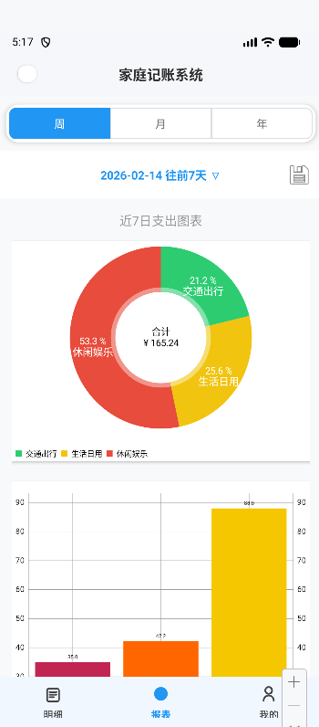
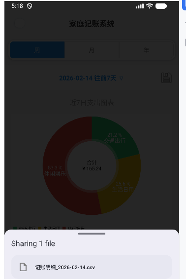

# 家庭记账本 · Family Accounting

基于 Android 的家庭共享记账系统，面向家庭财务协同与分权管理。支持家长/子女双角色、多维度统计报表与一键导出，适用于面试/作品集展示。

---

## 项目简介

本应用立足于**家庭财务协同**与**分权管理**：家长可查看子女账单、管理子账号与预算，子女在权限范围内独立记账；数据统一落库，报表与导出按角色与时间维度隔离，兼顾透明与隐私。

---

## 核心功能

| 模块 | 说明 |
|------|------|
| **RBAC 权限模型** | 支持管理员 / 家长 / 子女三种角色。家长可切换「本人」与「子女」视角查看明细，实现数据逻辑隔离；子女仅能操作本人账单，并可绑定父母账号。 |
| **可视化报表** | 集成 **MPAndroidChart**，提供饼图、柱状图、折线图；支持**周 / 月 / 年**多维度统计，按选定时段聚合收支。 |
| **数据导出** | 报表页一键生成 **CSV 财务报表**，通过写入 **UTF-8 BOM**（`0xEF 0xBB 0xBF`）解决 Excel 打开中文乱码，并调起系统分享。 |

---

## 技术栈

- **语言与运行时**：Android (Java 8)，minSdk 29
- **架构**：MVC
- **数据层**：JDBC（jTDS 驱动）直连 SQL Server
- **UI**：Material Design 3 规范，BottomNavigationView + Fragment，BottomSheetDialogFragment 个人信息菜单

---

## 技术亮点

### 云端服务自发现

在内网穿透（如 cpolar）场景下，公网 IP/端口随隧道重启变化，若在客户端写死地址则每次都要改包重装。

本项目通过**动态拉取 GitHub Gist 配置**实现**客户端零修改热更新**：

- 应用启动与「配置不对？点此重新获取」时，向固定 Gist Raw URL 请求 JSON（`db_host`、`db_port` 等）。
- 解析后写入本地 SharedPreferences，后续所有 JDBC 连接均使用该配置。
- **只需在 Gist 中更新 `db_config.json`**，用户侧点一次重新获取即可切到新隧道，无需改代码、无需重装。

既解决了内网穿透下 IP 不固定的痛点，又便于与 Web 端共用同一份配置源（参见仓库内 `docs/DEPLOY_AND_DB_ACCESS.md`）。

---

## 运行截图

| 登录 / 主页 | 报表与图表 | 导出与个人中心 |
|-------------|------------|----------------|
|  |  |  |
| 登录与主页概览 | 周/月/年多维度统计与图表 | 导出 CSV 与个人中心菜单 |

---

## 本地运行

1. **环境**：Android Studio（推荐最新稳定版），JDK 8+，可访问的 SQL Server（或经 cpolar 等隧道暴露）。
2. **配置**：在 [Gist](https://gist.github.com) 创建 `db_config.json`，格式参考：
   ```json
   { "db_host": "your-cpolar-host", "db_port": 端口, "dbName": "AccountBookDB", "user": "sa", "password": "***" }
   ```
   将 `JDBCUtils.DEFAULT_CONFIG_URL` 指向该 Gist 的 Raw 地址（或通过应用内「数据库配置」写入）。
3. **构建**：克隆仓库后使用 Android Studio 打开，Sync → Run 到真机或模拟器。
4. **数据库**：表结构及种子数据见 `docs/ANDROID_DB_REFERENCE.md`、`docs/seed_data.sql`。

---

## 仓库结构（简要）

```
app/src/main/
├── java/.../          # 业务与 UI（LoginActivity, MainActivity, *Fragment, Dao, Bean）
├── res/               # 布局、主题、drawable、菜单
docs/                  # 数据库说明、部署与 Gist 方案、种子数据与导入说明
```

---

## License

本项目仅供学习与面试展示。使用前请确保数据库与 Gist 配置符合自身安全与合规要求。
